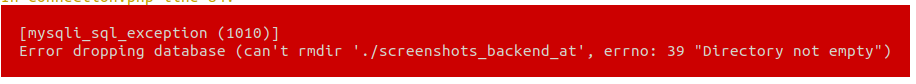

FAQ
===

Database Problems
-----------------

While running tests, it might happen that the following error is shown:

As the database is created new with every run and the required data are filled dynamically,
there never has to be worried about dataloss, concerning the following steps:

 * Find the location where MySQL (MariaDB) stores the data physically.
   Read the next chapter if you use DDEV / Docker environment.
 * Find the subfolder "screenshots_backend_at".
 * Delete any files in the subfolder "screenshots_backend_at".

All related commands have to be execúted with root / admin rights, so in linux you need the command prefix :bash:`sudo`.
Keep in mind that you act on the host system, so even if the docker container is linux, the host system might be Windows.
Double check that you delete the correct files. If you delete files in a wrong directory you'll have immanent dataloss.

Finding database files in DDEV / Docker environment
~~~~~~~~~~~~~~~~~~~~~~~~~~~~~~~~~~~~~~~~~~~~~~~~~~~

Finding the database files in DDEV / Docker environment is quite uncommon without according knowledge.
They are saved in the host system, so on CLI you've to exit the Docker Container. On the host system
with Linux as operating system docker saves the files in /var/lib/docker/volumes. The complete path
has the following pattern:

    var/lib/docker/volumes/<DOCKER-IMAGE>-<DATABASE-TYPE>/_data/<DATABASE-NAME>/<FILE>

So as example the path for a disturbing file could look like this:

    var/lib/docker/volumes/t3-screenshots-mariadb/_data/screenshots_backend_at/example.ibd

Further details about Docker storage you can find here: https://docs.docker.com/storage/

Class does not exist
--------------------

When the test "vendor/bin/run-unit-tests" is executed it might happen that errors like this are shown:

   1) TYPO3\Documentation\Screenshots\Tests\Unit\Util\ClassHelperTest::extractMembersFromClassPrintsCodeAsIsInFile
   ReflectionException: Class "TYPO3\Documentation\Screenshots\Tests\Unit\Fixtures\ClassWithComments" does not exist

In this case most liekely the autoloading by composer is not working like intended.
You can control the files "vendor/composer/autoload_psr4.php" and "vendor/composer/autoload_static.php":

 * vendor/composer/autoload_psr4.php should contain these lines:

     'TYPO3\\Documentation\\Screenshots\\Tests\\' => array($vendorDir . '/t3docs/screenshots/Tests'),
     'TYPO3\\Documentation\\Screenshots\\' => array($vendorDir . '/t3docs/screenshots/Classes'),

 * vendor/composer/autoload_static.php should contain these lines:

        'TYPO3\\Documentation\\Screenshots\\Tests\\' =>
        array (
            0 => __DIR__ . '/..' . '/t3docs/screenshots/Tests',
        ),
        'TYPO3\\Documentation\\Screenshots\\' =>
        array (
            0 => __DIR__ . '/..' . '/t3docs/screenshots/Classes',
        ),

If those lines are missing the tests can't all be executed, even Classes with less deep namespace seem to be found.
